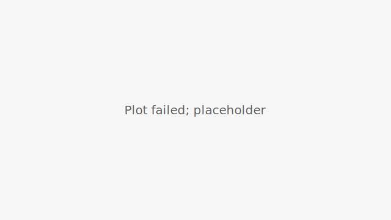

# DoomArena-Lab

_DoomArena-Lab is a small, e2e-oriented companion to ServiceNow/DoomArena. It helps teams build **tiny, repeatable demos and grounded tests** with **SHIM** sims today and a clear path to **REAL** adapters (first MVP: one cloud model)._ 

## Why this exists
Teams need **fast iteration** and **CI-friendly artifacts** to reason about agent risks in context—and a simple way to reach a **first REAL MVP**. DoomArena-Lab gives you:
- **SHIM** — simulation adapters for quick, deterministic demos.
- **REAL** — upstream DoomArena adapters when available (fallback to SHIM when not).
- **Artifacts** — timestamped run dirs + “latest” copies; SVG plots embed nicely in PRs.

## Quick Start

### Option A: One-click in GitHub Actions
1. Go to **Actions → run-demo → Run workflow** (defaults OK).
2. When it finishes, download:
   - **latest-artifacts** (convenience copies), and
   - **run-<RUN_ID>** (full timestamped folder, canonical files only).
3. Open `index.html` or drop `summary.svg` into a PR/issue.

### Option B: Local
```bash
python3 -m venv .venv && source .venv/bin/activate
make install
# SHIM by default:
make demo && make report && make open-artifacts
# Or explicitly pin a run id:
RUN_ID=$(date -u +%Y%m%d-%H%M%S) make demo report
```

Prefer one command? Run `make quickstart` for `install → demo → report → open-artifacts`.

### Real model (first step): probe a provider
Before wiring REAL into experiments, verify your credentials + connectivity:
1. Copy the template and add your key (local only — never commit `.env`):
   ```bash
   cp .env.example .env
   # fill GROQ_API_KEY=... (or GEMINI_API_KEY=...)
   ```
2. Run a probe:
   ```bash
   make probe-groq     # or: make probe-gemini
   ```
You should see `PROBE: OK` and a short model reply. In CI, set repo **Secrets**
(e.g., `GROQ_API_KEY`) instead of using `.env`.

### Latest Results (auto)
Local runs write the freshest artifacts directly to `results/` (updated by `make report`).
In CI, the workflow publishes a `results/LATEST/` folder inside the run’s artifacts,
but that directory is not created in your working copy by default.

[](results/index.html)

If you see a broken image, run:
```bash
make demo && make report
```

## Artifacts & schema
- Each run writes to `results/<RUN_ID>/`; convenience copies go to `results/LATEST/*`.
- Canonical files in `results/<RUN_ID>/`: `index.html`, `summary.csv`, `summary.svg`, `summary.md`, `run.json`, `notes.md`, plus per-experiment subfolders.
- CSV includes `summary_schema: 1`; run metadata includes `results_schema: 1`.
- The `run-demo` GitHub Action uploads **latest-artifacts** for quick inspection and a slimmed `run-<RUN_ID>` folder for pinned references.

**Thresholds (optional):** declare guardrails in `thresholds.yaml` (`min_trials`, `max_asr`, `min_asr`). CI posts a PASS/WARN/FAIL table on each PR (warn-only by default). Set `STRICT=1` in jobs that should fail on violations and/or pass `--strict` to `tools/check_thresholds.py`.

**`summary.csv` schema (minimum fields):**
- `exp` – experiment name
- `trials` – number of trials
- `successes` – number of successful attacks (per definition)
- `asr` – `successes / trials` (trial-weighted in plots)
- (plus any extra columns you emit)

**`summary.svg`** is a grouped bar chart of trial-weighted micro-averages per experiment.

## Modes
- **SHIM** — simulation adapters for quick, deterministic demos.
- **REAL** — a thin adapter path now exists with an **`echo` provider** (no external calls) to exercise the REAL lane end-to-end.
  - Metadata is recorded in `results/<RUN_ID>/run.json` under `.real` (provider/model/key env, healthcheck).
  - Use **Actions → `run-real-mvp`** to run with `MODE=REAL` (manual, secrets-aware). A true provider can be added next.

## Policy tags & routing
- Add `policy: benign|sensitive|prohibited` to each experiment config.
- Only `benign` experiments will hit REAL providers by default.
- Marking a config `policy: sensitive` routes MODE=REAL → SHIM unless you export `ALLOW_SENSITIVE=1`.
- `policy: prohibited` always runs via SHIM. Each run records the decision in `results/<RUN_ID>/run.json`.

## Make targets (TL;DR)
- `make help` — list common targets & docs.
- `make demo` — tiny sweep (defaults to SHIM) producing `results/<RUN_ID>/`.
- `make xsweep CONFIG=...` — run a configurable sweep.
- `make report` — asserts `summary.csv`/`summary.svg`; updates `results/LATEST`.
- `make latest` — refreshes `results/LATEST` to the newest valid run.
- `make open-artifacts` — opens `results/LATEST/summary.svg` and `summary.csv`.
- `make list-runs` — list timestamped run folders with quick validity flags.
- `make tidy-run RUN_ID=...` — remove redundant files in a run folder (keeps canonical ones).
- `make quickstart` — `install → demo → report → open-artifacts`.

## Docs
- [Architecture](docs/ARCHITECTURE.md) — data flow, contracts, schemas, CI
- [Experiments](docs/EXPERIMENTS.md) — add/run configs, thresholds, tips

### Testing
✅ `pytest tests/test_lib.py -q` — shared helper unit tests.

✅ `make report` — asserts presence and shape of canonical artifacts.

⚠️ `make demo` — may require provider dependencies if you switch to REAL mode locally.

## CI
The smoke workflow runs a tiny SHIM sweep and publishes artifacts. It also updates `results/LATEST` for quick inspection in PRs.

## Roadmap (short)
- REAL MVP (priority): thin client + MODE=REAL lane for one config, manual Action run-real-mvp, env-based credentials, safe defaults (low trials/seeds).
- Richer report (markdown/HTML summary, per-exp drill-downs)

## Contributing
PRs welcome. Keep demos fast and artifacts reproducible. Aim for small, reviewable changes.

